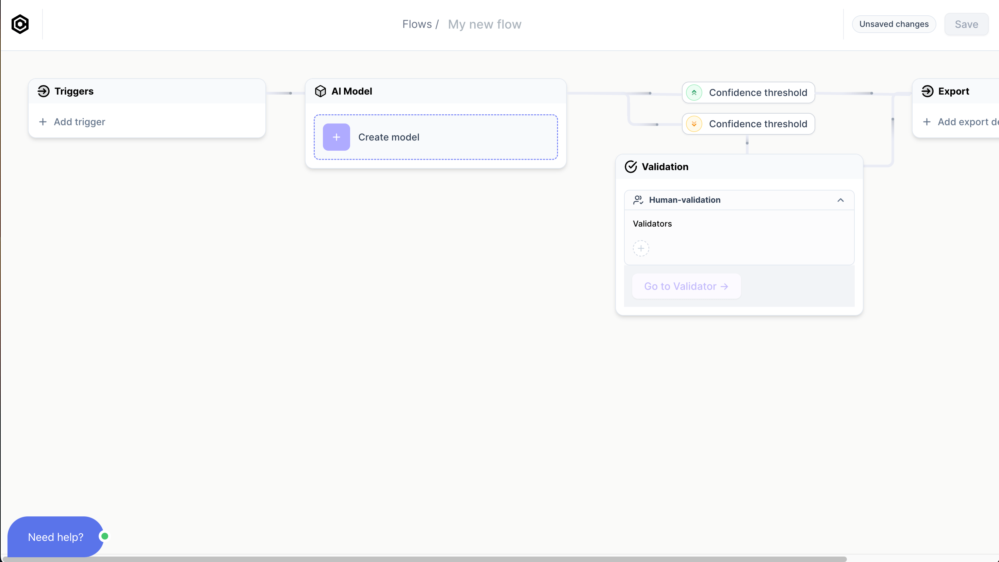
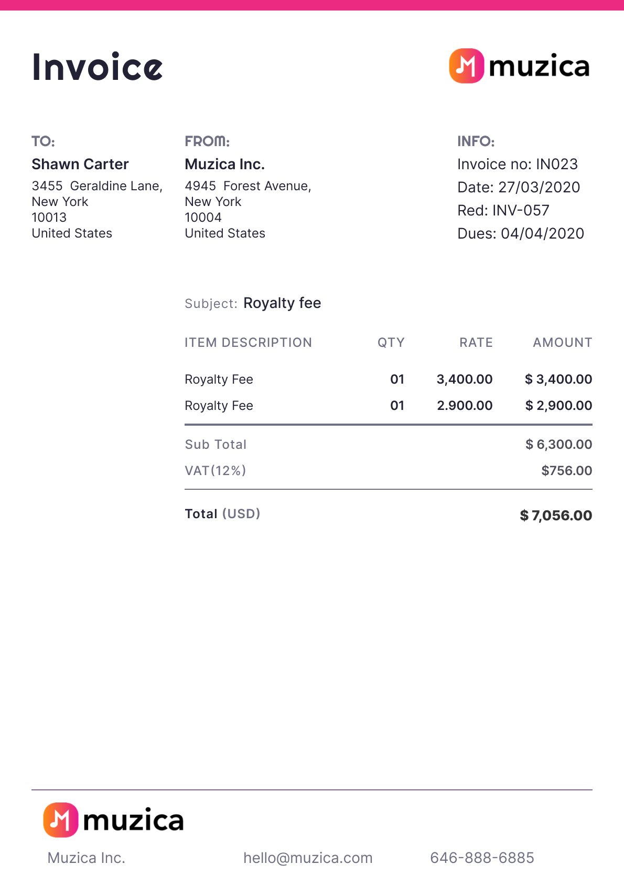
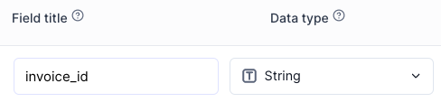
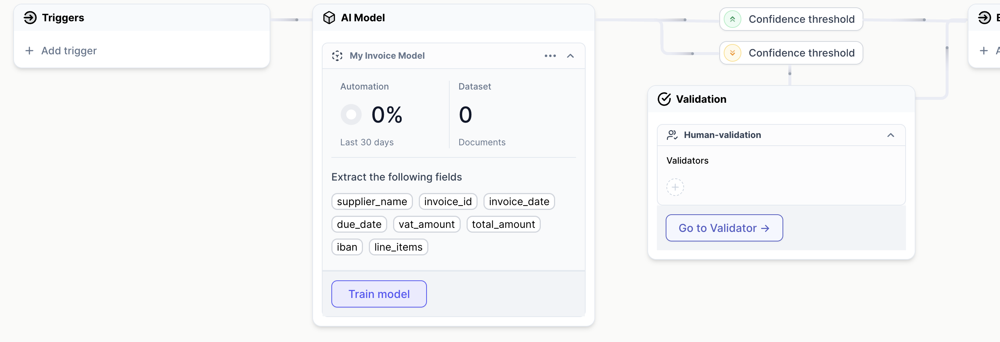

# Create your AI Model

import Tabs from '@theme/Tabs';
import TabItem from '@theme/TabItem';

## 1. New Flow
### Go to Flows
Start by completing the sign-up to a free Cradl AI account. Once logged in: 
- Find and click **`Flows`** in the top navigation bar. 
- Create a **`New Flow`**. 

Welcome to your Flow overview. A Flow is simply a pipeline that connects an AI model with your documents' Triggers and Export destinations.

<Tabs>
  <TabItem value="triggers" label="Trigger" default>
   - **`Triggers`** is where you import your documents after you have trained your `AI Model`. Documents can be imported by `manual upload`, `email`, `API`, or `integrations`.
  </TabItem>

  <TabItem value="aiModel" label="AI Model">
    - **`AI Model`** is where you create your custom `AI model` - trained to scan your documents.
  </TabItem>
  
  <TabItem value="validator" label="Validator">
     - **`Validator`** is where newly scanned documents are ready to be validated by you.
    </TabItem>

    <TabItem value="export" label="Export">
      - **`Export`** is the output destination for your scanned documents. Documents can be exported to `webhook`, `API`, `integrations`, `CSV`, etc.
    </TabItem>
</Tabs>

{/* 

  
Triggers

- **`Triggers`** is where you import your documents after you have trained your `AI Model`. Documents can be imported by `manual upload`, `email`, `API`, or `integrations`.

  
AI Studio

- **`AI Studio`** is where you create your custom `AI model` - trained to scan your documents.

  
Validation

- **`Validation`** is where newly scanned documents are ready to be validated by you.

  
Export

- **`Export`** is the output destination for your scanned documents. Documents can be exported to `webhook`, `API`, `integrations`, `CSV`, etc.

 */}

### Go to New model
From your `Flows` overview, click on **`New Model`**. 

New Model:

## 2. New model 
### Name your model
The model's name is only for your convenience. Examples of names can be "invoice model", "receipt model".

### Choose model from template or choose model from scratch
Whether to start from scratch or whether to start from a template depends on your document. Here are some tips:

  
Model from template

   
Start with a model from template if you find a template with `fields` that are similar to your documents. It is totally OK to add new `fields` or to remove `fields` you do not need from a template.

   
It is recommended to start with a **template** if you:

    <ul>
        <li>find a template with `fields` that are similar to those you want to extract from your documents (i.e, a template might have a "total_amount" field, and so does your documents).</li>
        <li> want to test a model on your data quickly. Using a template will give better results out of the box.</li>
    </ul>
  

  
Model from scratch

   
When starting from scratch, you define and train every `field` yourself. It is the best option if your documents are dissimilar to any of the templates, but it takes more training data to get as good results as a template.

### Choose fields you want to extract from your documents
Make a list of the data you want to extract from your documents. Your list of data should be informed by

- The data you want to export out of Cradle AI and into your other apps. 
- It is recommended to only include **data that you need** when training your first model. You can introduce data that is **nice to have** once you are getting good results from your base model.

  
See example

Typical data you would want to extract from an invoice include: the recipent's full name, the recipient's address, invoice ID number, total amount, VAT, currency, etc.

  
  

## 3. Create Fields 
For every piece of information you want to extract from your documents, you create a corresponding `field`. Your amount of fields is flexible; you can start with a limited amount and introduce new fields in the future if neccessary.

A field consists of a field title and a data type.

  

### Choose field Title
- A `field`'s `title` is yours to decide. It does not have to correspond to what you see on your documents. 
- For example, if your documents have a total amount of 20.000 labelled as "total: 20.000", you are free to call your field's name `total`, `total amount`, `price`, or something in another language.
:::warning
Avoid changing a `field`'s `title` once you have started training your model (we will train the model in the next section of this tutorial). Changing the title of your fields after training will require you to retrain that specific field.
:::

### Choose field Data type
A `field`'s ` data type` improves the model's performance. For example, using the `date` type instead of a `numeric` type for a date will give better results.

<Tabs>
  <TabItem value="string" label="String" default>
  
`String` is the most commonly used type. It is used for data containing letters or a mix of letters and numbers.

  
A common usecase for strings are addresses, which you can create in one `string` field instead of making multiple fields for each line of the address:

  

    
Example of a multiline address in a String field.

    
    

  </TabItem>

  <TabItem value="amount" label="Amount">
  
Use the `Amount` type if your document has monetary amounts.

  </TabItem>
  
  <TabItem value="date" label="Date">
    
Use the `Date` type if your document has dates.

    </TabItem>

    <TabItem value="numeric" label="Numeric">
        
`Numeric` is used for numbers, such as quantities, numeric IDs, etc. A Numeric field does not accept letters.

    </TabItem>

    <TabItem value="lineItems" label="Line items">
    

        `Line items` are used for single and multiline tabular data:
    

    

        
Example of multiline tabular data.

        
    

    </TabItem>

    <TabItem value="classification" label="Classification">
        
Info about classification.

    </TabItem> 
</Tabs>

{/* 

  
String

  
String is the most commonly used type. It is used for data containing letters or a mix of letters and numbers.

  
A common usecase for strings are addresses, which you can create in one `string` field instead of making multiple fields for each line of the address:

  

    
    

 */}
{/* 

  
Amount

  
Use the `Amount` type if your document has monetary amounts.

 */}
{/* 

  
Date

  
Use the `Date` type if your document has dates.

 */}

{/* 

  
Numeric

  
Numeric is used for numbers, such as quantities, numeric IDs, etc. A Numeric field does not accept letters.

 */}

{/* 

  
Line items

  

  Line items are used for multiline tabular data:
  

  

  
  

 */}

{/* 

  
Classification

 
Info about classification.

 */}

### Create model & save Flow
When you have finished adding your `fields`: 
1. Click **`Create model`**
2. Back in your `Flows` overview, click save your Flow by clicking **`Save`** in the upright corner of the top right navigation bar.
3. In your `Flows` overview, your `AI Model` box will now have a button named **`Train model`**:

### Go to Train model
Click **`Train model`** and proceed to the next section of this tutorial, where we will train the model.