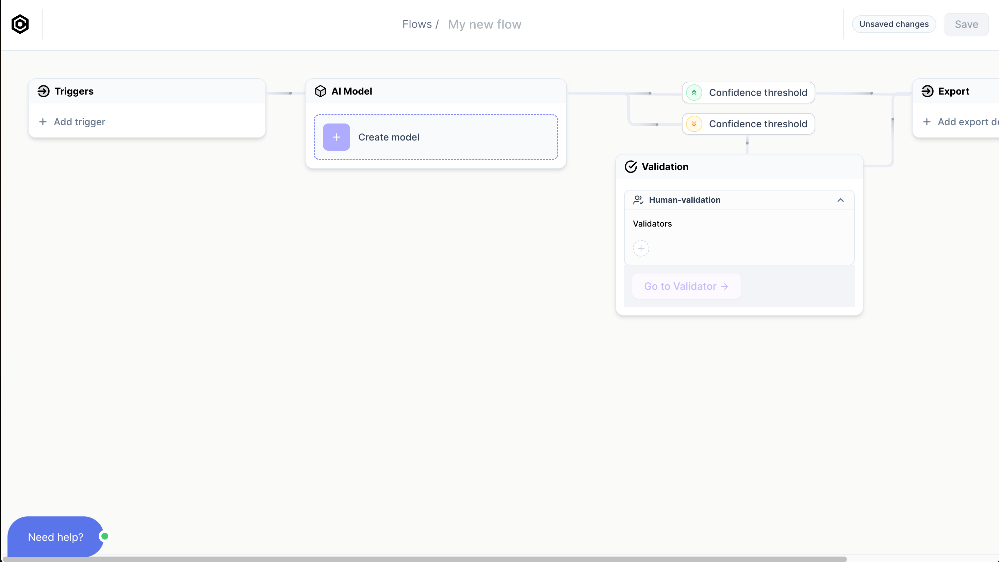
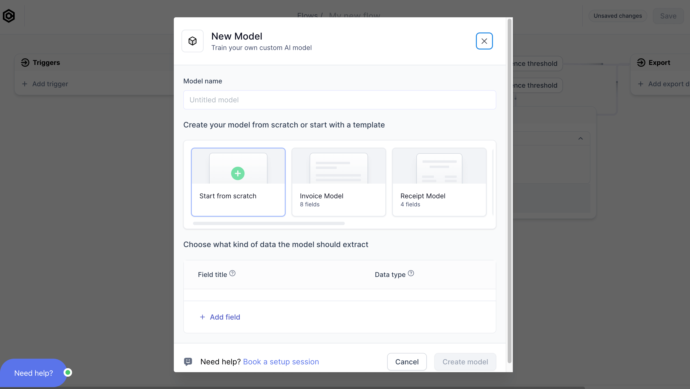
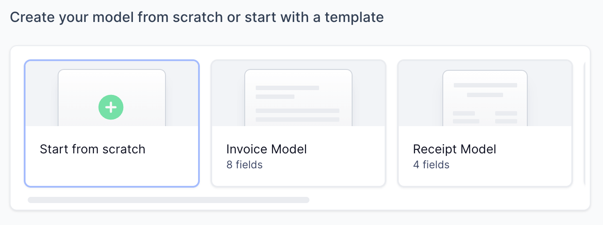
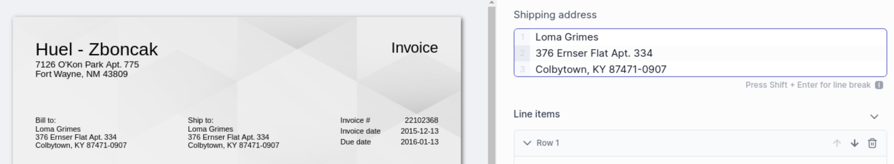

# Create your AI Model

import Tabs from '@theme/Tabs';
import TabItem from '@theme/TabItem';

:::info
This guide does assume that you've created a [free Cradl AI account](https://app.cradl.ai/login?redirect=signup&utm_campaign=docs) in order to follow along.
:::

## 1. Create new Flow
Start by completing the sign-up to a free Cradl AI account. Once logged in, 
- find and click **`Flows`** in the top navigation bar. 
- Create a **`New Flow`**. You will be taken to this screen:

Welcome to your `Flow` overview.
A `Flow` is simply a pipeline that connects your (yet to be created) `AI model` with your documents' `Triggers` and `Export` destinations.

  
Triggers

- **`Triggers`** is where you import your documents after you have trained your `AI Model`. Documents can be imported by `manual upload`, `email`, `API`, or `integrations`.

  
AI Studio

- **`AI Studio`** is where you create your custom `AI model` - trained to scan your documents.

  
Validation Studio

- **`Validation studio`** is where newly scanned documents are ready to be validated by you.

  
Export

- **`Export`** is the output destination for your scanned documents. Documents can be exported to `webhook`, `API`, `integrations`, `CSV`, etc.

From your `Flows` overview, click on **`New Model`**. You will be taken to this screen:

There are three tasks we need to complete here:

## 2. Create New model
When creating a `New model`, there are three tasks you need to complete:
- Name your model. The name is only for your convenience. Examples of names can be "invoice model", "receipt model".
- Chose whether to start from scratch of from a template
- Know what fields you want to extract

### Model from template or model from scratch?
{/*  */}

  
Model from template

   
Start with a template with `fields` that are similar to parts you want to extract from your documents. It is totally OK to add `fields` you need or to remove `fields` you do not need from a template.

   
It is recommended to start with a **template** if you:

    <ul>
        <li>find a template with `fields` that are similar to those you want to extract from your documents (i.e, a template might have a "total_amount" field, and so does your documents).</li>
        <li> want to test a model on your data quickly. Using a template will give better results out of the box.</li>
    </ul>
  

  
Model from scratch

   
When starting from scratch, you define and train every `field` yourself. It is the best option if your documents are dissimilar to any of the templates, but it takes more training data to get as good results as a template.

### Knowing the fields you want to extract from your documents
Make a list of the data you want to extract from your documents. Your list of data should be informed by

- The data you want to export out of Cradle AI and into your other apps. 
- It is recommended to only include **data that you need** when training your first model. You can introduce data that is **nice to have** once you are getting good results from your base model.

Here is an example of an invoice. Typical data you would want to extract from an invoice include: the recipent's full name, the recipient's address, invoice ID, total amount, VAT, currency,  

  

## 3. Create `fields` to extract
For every piece of information you want to extract from your documents, you create a corresponding `field`.
The amount of fields you can have are not fixed. You can start with a limited amount and introduce new fields in the future if your documents change.

### Field `title`
A `field`'s `title` is yours to decide. It does not have to correspond to what you see on your documents. For example, if your documents have a total amount of 20.000 labelled as "total: 20.000", you are free to call your field's name `total`, `total amount`, `price`, or something in another language.
:::warning
Avoid changing a `field`'s `title` once you have started training your model (we will train the model in the next section of this tutorial). Changing the title of your fields after training will require you to retrain that specific field.
:::

### Field `type`
A `field`'s `type` improves the model's performance. For example, using the `date` type instead of a `numeric` type for a date will give better results.

  
String

  
String is the most commonly used type. It is used for data containing letters or a mix of letters and numbers.

  
A common usecase for strings are addresses, which you can create in one `string` field instead of making multiple fields for each line of the address:

  

    
    

  
Amount

  
Use the `Amount` type if your document has monetary amounts.

  
Date

  
Use the `Date` type if your document has dates.

  
Numeric

  
Numeric is used for numbers, such as quantities, numeric IDs, etc. A Numeric field does not accept letters.

  
Line items

  

  Line items are used for multiline tabular data:
  

  

  
  

  
Classification

 
Info about classification.

