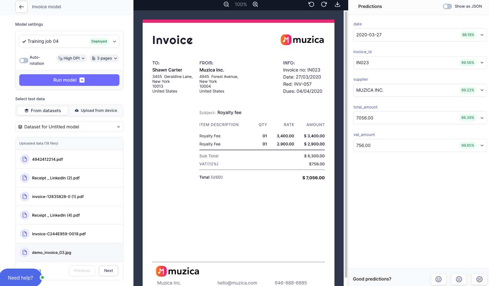

# Test your AI model

## 1. Select a document to test
After clicking **`Test model`**, you will be taken to the Test interface.
Either select an existing document from your uploaded documents or upload a new document.

Test interface:

## 2. Run model
Click **`Run model`**, and you will see the extracted data from your document on the right: 

Congratulations, you just scanned your first document with your own AI Model. 

  
Inspect extracted data

Based on 15 training documents, the model:

<ul> 
<li> Predicted 5/5 fields correctly. However, the correct value for `total_amount` is not the first, but the second likeliest prediction. This indicates that more training data is necessary. </li>
<li> ISO formats dates automatically. </li>
</ul>
 

 

## 3. Go to Validator
Now that you have tested your `AI Model` it is time to leave testing and upload some real documents and improve your model in the `AI Validator`. Go back to your `Flows` overview (by clicking the Cradl AI logo in the top navigation) and click on `Go to Validator`

From Flow overview, click Go to Validator

