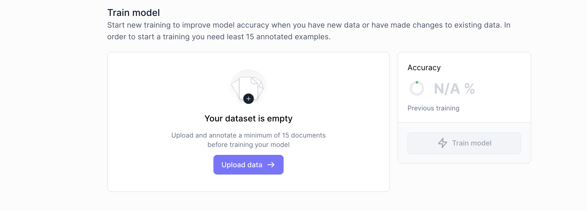
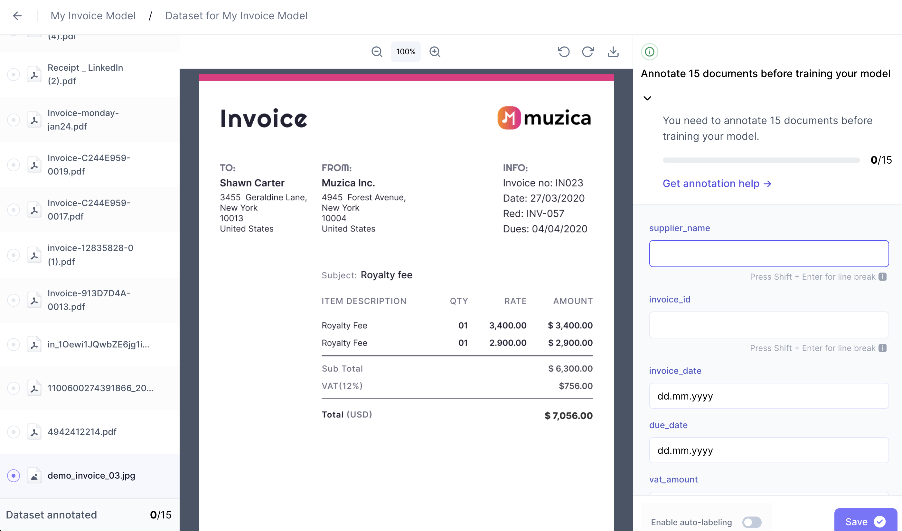
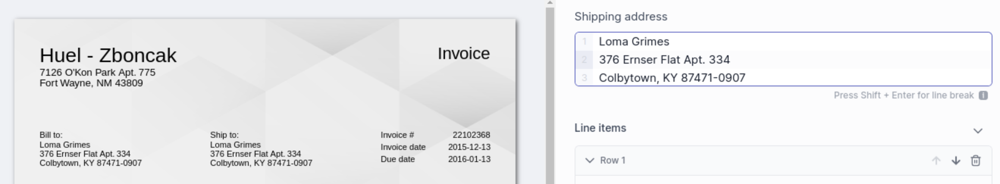
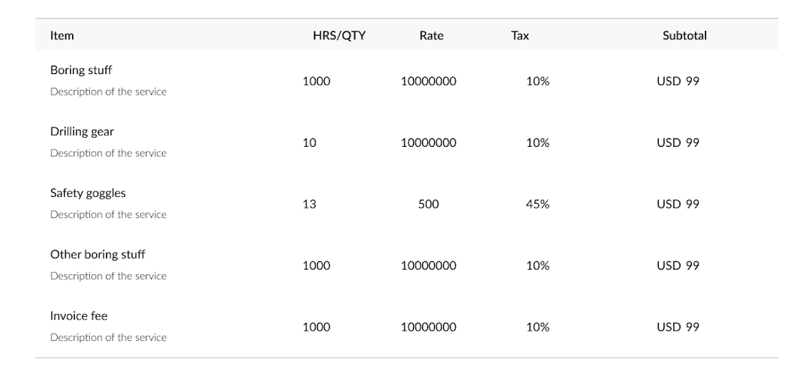
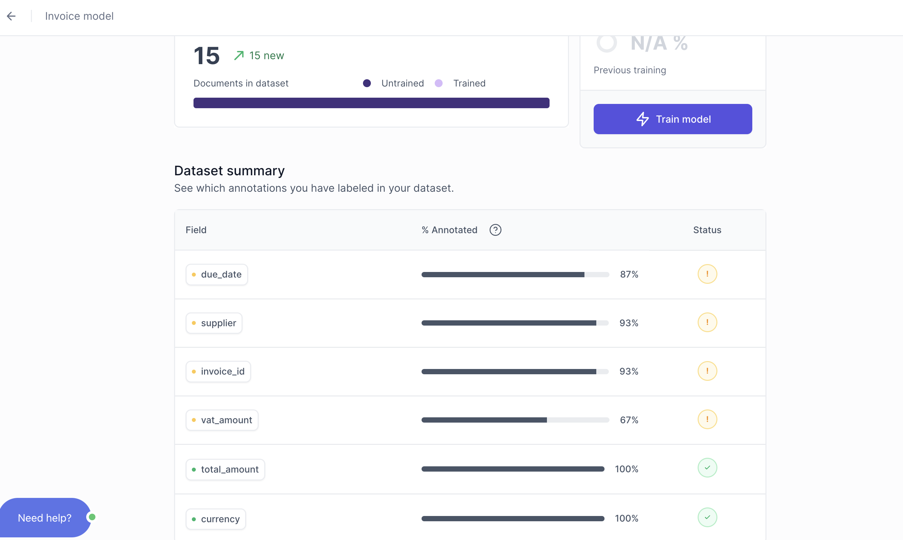
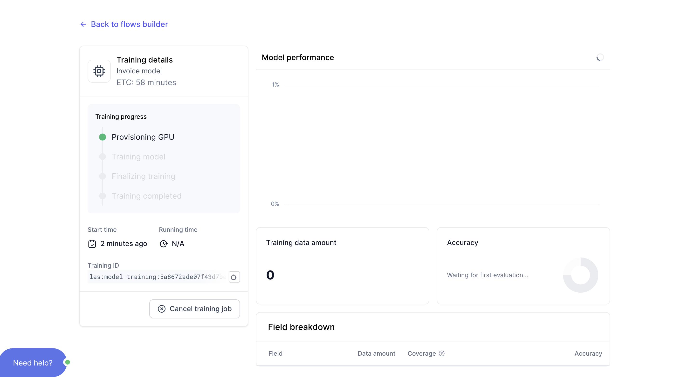
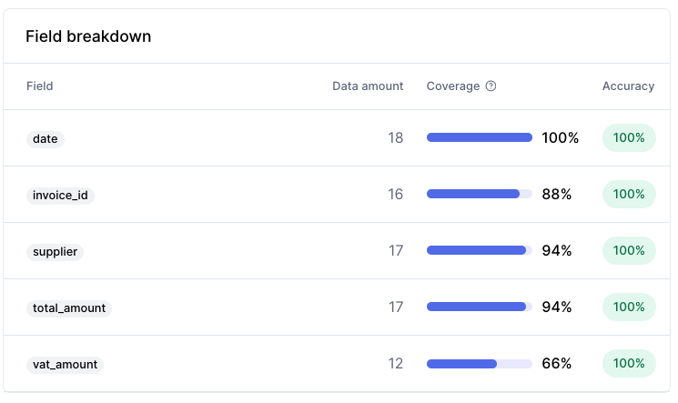
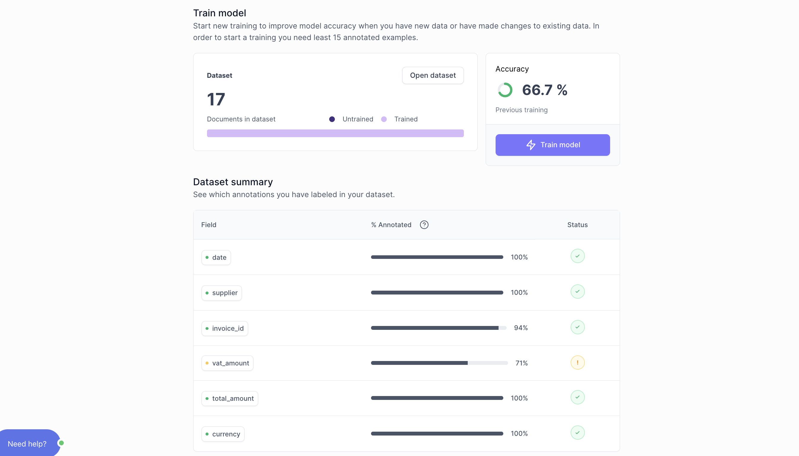
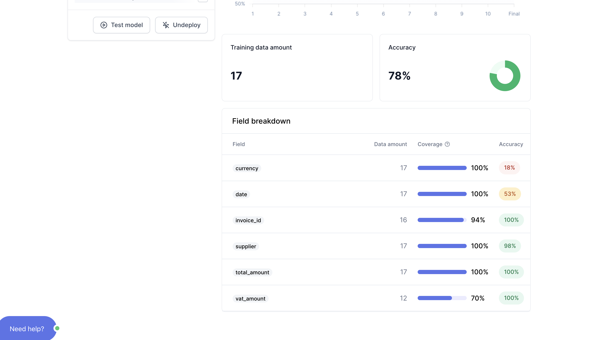

# Train your AI Model

import Tabs from '@theme/Tabs';
import TabItem from '@theme/TabItem';

##  1. Upload training documents

Clicking **`Train model`** takes you to an upload manager:

Training your model requires a minimum of 15 uploaded documents.

Here are some key points to keep in mind when choosing your first 15 training documents:

- You will likely want to extract data that might be **present** on some documents, but **absent** from other documents. For example, 15 of your documents might have "total amount" whereas "VAT" might only be present on 8. This is unproblematic, but try to compensate for the 7 documents without "VAT" by including 7 new documents with VAT, bumping your total documents up to 22. Your aim is to have **15 samples of every field** rather than 15 documents.
- For a production setting, you want to train your model on more than 15 documents. You want to train until your model gives your reliable results and asks for your feedback when it is unsure of its accuracy (we will set up such a feedback loop later in this tutorial).

## 2. Annotate training documents
### How to annotate
The `annotation` stage is where you tell your `AI Model` "what to look for" when it scans your documents.

After uploading your first training documents, you will be taken to the annotation interface:

:::info

When scanning your documents, your `AI Model` uses a mix of vision and textual understanding. This is important to keep in the back of your mind when you annotate your training documents. Typically, you will want your input to **mirror** the document as closely as possible. For example: if a date is written in MM/DD/YYYY format, type it as what you see (a MM/DD/YYYY date) rather than another format, such as DD/MM/YYYY or YYYY/MM/DD.
:::

Here are some tips for each field `data type` to help you make informed decisions when you `annotate` your training documents:

  
String

  
In addition to regular text and text+numbers, use strings are addresses, which you can create in one `string` field my mirroring how the address is depicted in your documents: 

  

    
  

  
Amount

  
When you type something in the `amount` field, your input will be **auto-formatted:** 

  - **Commas** "," are formatted to separate thousands. 
  - **Dots** "." are formatted to separate decimals. 
  
For example: Fifteen-thousand will look like: 15,000.00

  
Date

  
Dates are very common to extract. When you type a date in a `date` field, you must **mirror** the way the date is written on your document. 

  :::info
  If you created your model before 30th April 2024, you must continue entering dates in a DD/MM/YYYY format instead of mirroring what is written in your document.
  :::

  
Numeric

  
Numeric is used for numbers, such as quantities, numeric IDs, etc. A Numeric field does not accept letters. 

  
Line items

  
 Line items are used for multiline tabular data. You do not have to annotate every single item in the table - 3 will do. If there are more than 3 items, pick 3 random items rather than the first three for better results.

  

  
  

  
Classification

### Go to training
Once you havee annotated at least 15 documents, you're presented with two options, `Add more data` or `Go to training`. Click **`Go to training`**

Summary of your annotated documents:

- `Green` checkmarks means that you have provided at least 15 samples of a `field`. Well done. 
- `Yellow` checkmarks means that you have not provided at least 15 samples of a `field`. While not necessary for testing, it is recommended that you provide at least 15 samples.

##  3. Train model
Congratulations, you have finished the hard part. In the next section, it is time for your `AI model` to start working.

### Go to Train model
From your annotation summary, click **`Train model`** to begin the model's initial training.
Training usually takes from 20 to 60 minutes. 

  
Viewing training progress

  
While your model is training, you can monitor the training progress by clicking **`View training details`** from your `Flow` overview:

  

    
  

  
No action is required from you here. Simply wait until the training is over.

### Review training results
Once your training is complete, you will see the results of your training. 

  
Training results

  

    
  

  
- `Green` checkmark means that the model was able to predicted the field with high confidence.
- `Yellow` checkmark means that the model was unable to predict the field with high confidence and will not automatically parse the field before a manual inspection. A yellow checkmark is often the result of either insufficent training or inconsistent annotation of training data.

{/* 

  
Good training results

  
 Line items are used for multiline tabular data. You do not have to annotate every single item in the table - 3 will do. If there are more than 3 items, pick 3 random items rather than the first three for better results.

  

    
  

  
Poor training results

  
 Line items are used for multiline tabular data. You do not have to annotate every single item in the table - 3 will do. If there are more than 3 items, pick 3 random items rather than the first three for better results.

  

    
  

 */}

### Go to testing
After reviewing your training results, click **`Test model`** from the training results screen.
