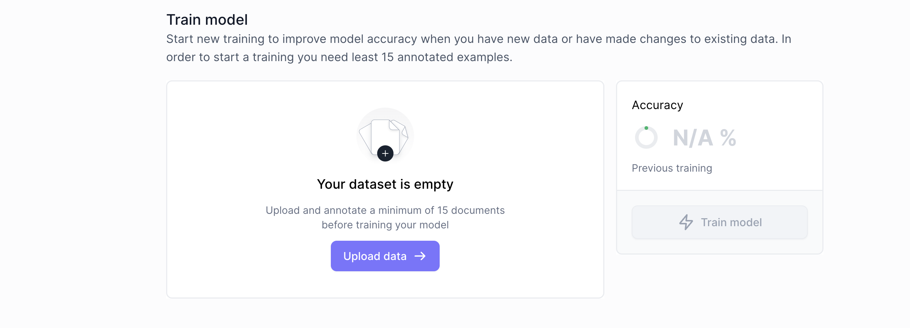

# Train your AI Model
In this section of the tutorial, we will:
- upload training documents.
- explain how to choose your first training documents.

## Uploading your training documents.
Clicking **`Train model`** takes you to this screen:

You need at least **15 training documents** to complete your model, so make sure you upload at least 15 training documents.

## Choosing your first 15 training documents.
Your choice of training documents is an important decision. Here are key points to keep in mind:
- Your **training** documents and **real** documents are the same documents. The difference is simply that you will manually `annotate` your training documents (in the next section of this tutorial) whereas your real documents are processed automatically by your `AI model` once it is trained.

- You will likely want to extract data that might be **present** on some documents, but **absent** from other documents. For example, 15 of your documents might have "total amount" whereas "VAT" might only be present on 8. This is unproblematic, but try to compensate for the 7 documents without "VAT" by including 7 new documents with VAT, bumping your total documents up to 22. Your aim is to have **15 samples of every field** rather than 15 documents.

:::warning
15 documents is the bare minimum in order to get your `AI model` to start scanning your documents. It is a low amount of training data designed to get you up and running quickly, so that you can **improve your model while testing it** on more training documents.

For a production setting, you want to train your model on more than 15 documents. You want to train until your model gives your reliable results and asks for your feedback when it is unsure of its accuracy (we will set up such a feedback loop later in this tutorial).
:::
