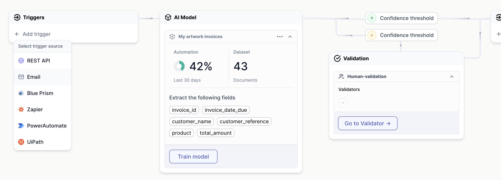
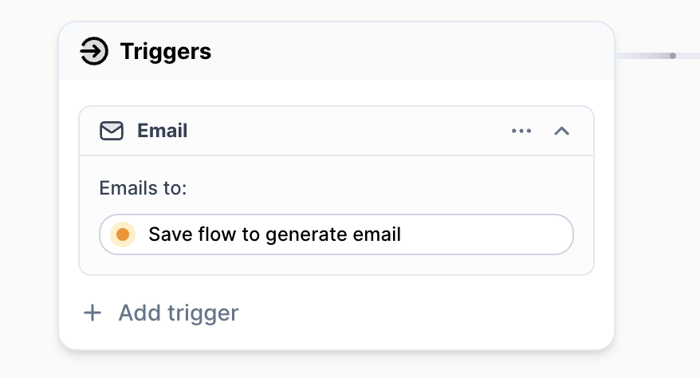
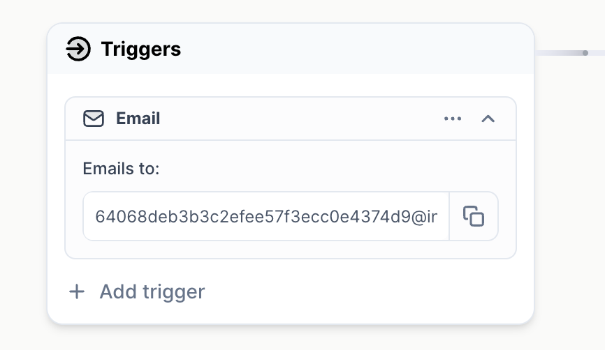

# Connect to `Trigger`
We will be using an `email` as our `Trigger`. You can find guides to the other triggers under our integrations guides, such as REST API, Blue Prism, uiPath and Zapier. 

## Adding `email` trigger
From your `Flow` overview, click **`+ Add trigger`**:

- Choose **`Email`**

You might be asked to `save` your `Flow`; 

In which case you simply **`Save`** your flow from the top navigation bar.

After saving, you should see a code. This code is a Cradl email address that will automatically scan the documents it recieves. You will forward your documents to this address from your email provider in order to trigger an automatic scan of the document in Cradl.

In order to try this out: 
 - **Log in** to your email provider.
 - **Create an email**, paste in the Cradl email address as the recipient.
 - **Attach** your document as a **file attachment** - not in the body text area of the email.
 - **Send** the email. 

 :::warning
 Make sure you:
    -  Add the document as a file attachment (such as PDF or an image file)

Make sure you do not:
    - Add the document inside the email's body text area.
    - Do not add more than one attached file per email. 
 :::

## Invoking `email` trigger
Once you send the email with the file attachment, you will trigger your `flow` to automatically scan the document. You will find the result of your automated scans in in the `Validtion studio`.