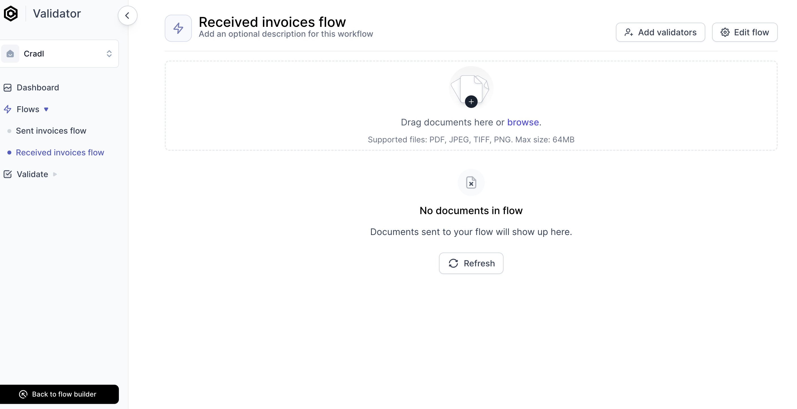
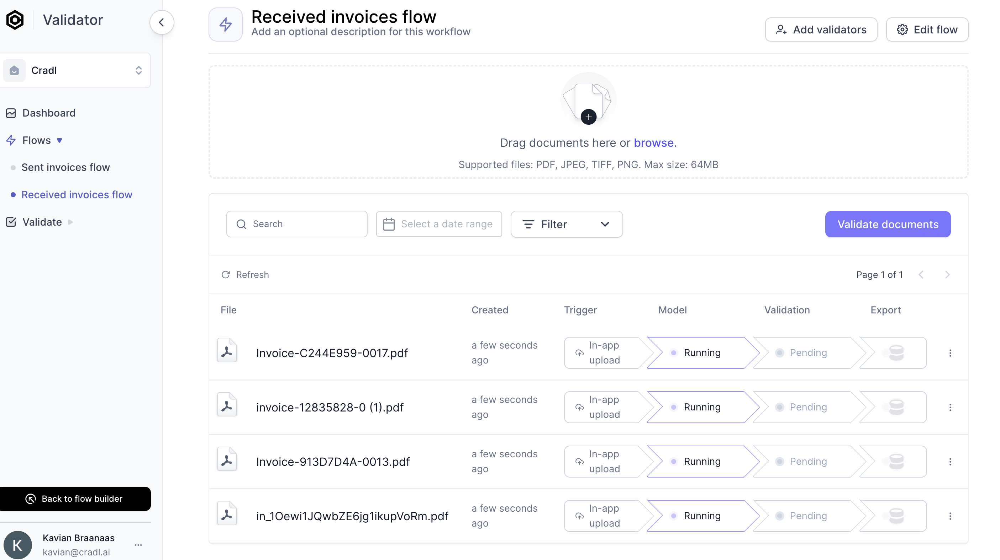
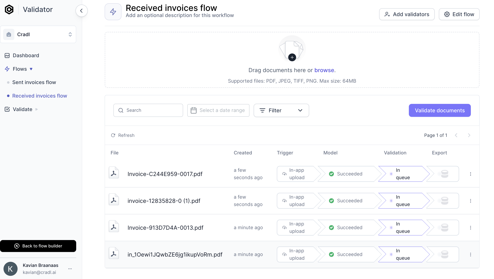
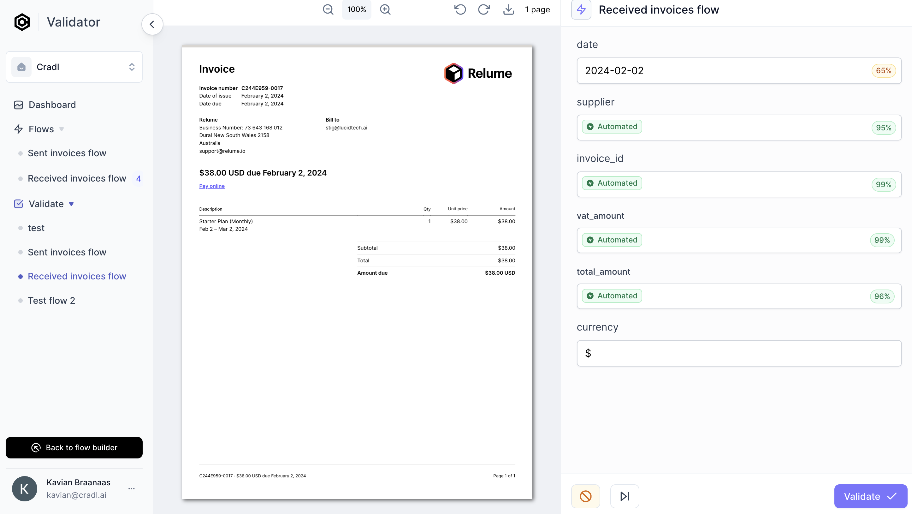

# Validate documents
:::info
This guide assumes that you have created, trained and tested your AI Model from the previous steps.
:::

## 1. Upload documents 
Welcome to the `AI Validator`. Simply upload a document in order to start scanning.

Empty AI Validator view.

 You will notice that the `AI Model` will automatically start running and scan documents when they are uploaded from the AI Validator interface:

Documents are being scanned in the AI Validator.

## 2. Validate documents 
Once your model has stopped running (click  **`refresh`** for status updates), click on **`Validate documents`**:

Document scanning completed.

## 3. Inspect extracted data from documents
After your AI Model has extracted data, the model assigns a confidence level to each field.

- If all the scores is above the confidence threshold (default is 95%), the model will not ask for your feedback and automatically export the document.
- If one of the confidence scores is below your threshold, you will be notified and ask to validate the result. 
- Your corrections will be used to improve the model when you retrain it. 

Extracted data view.

Congratulations. You know have an AI model that automatically scans manually uploaded documents. Click **`Validate`** 

In the next section of this guide, we will set up automated uploads of documents instead of manual uploads. 