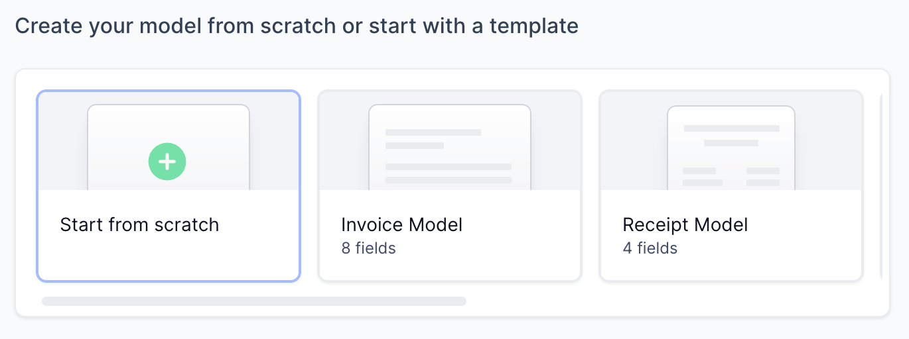
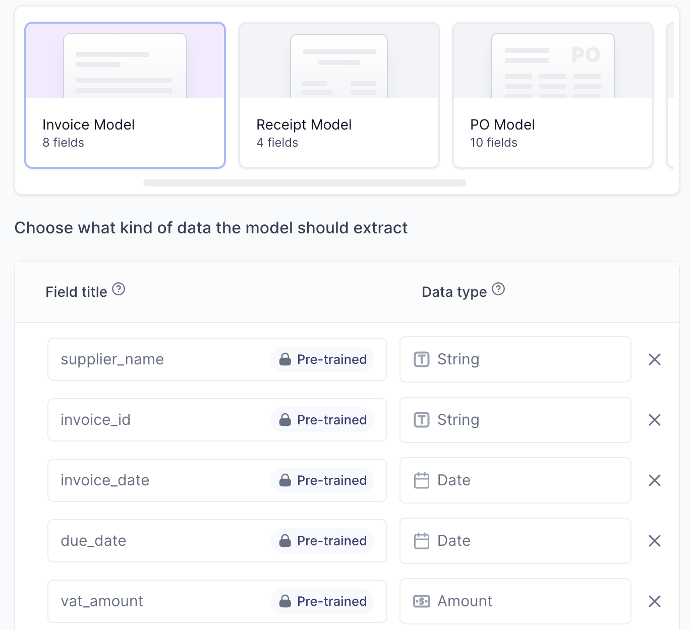
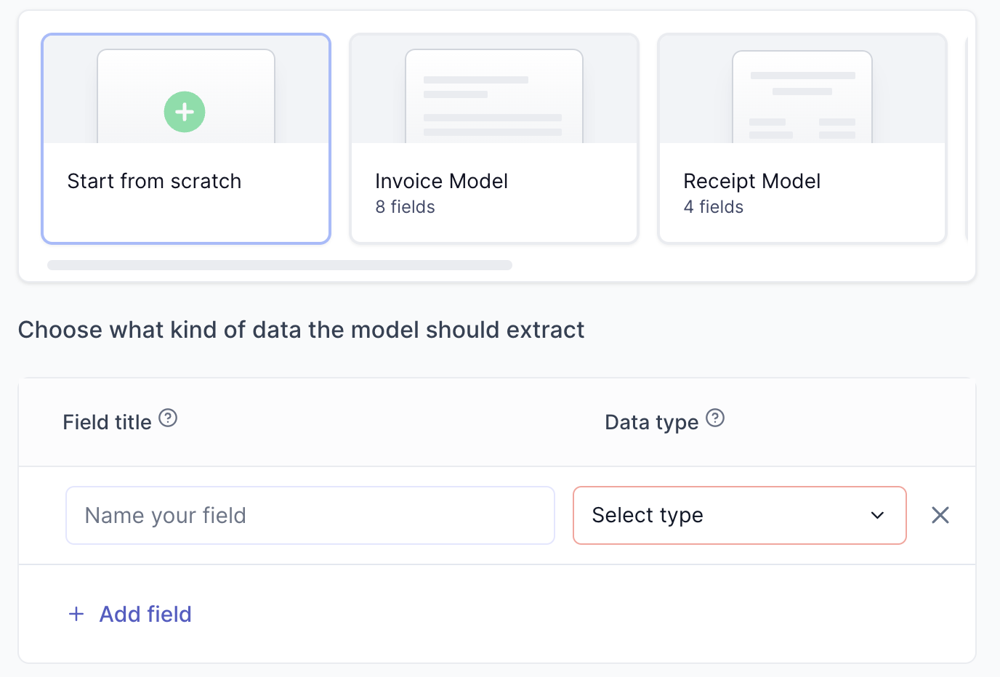

# Create new AI Model

import { Box, TextBox, BoxAction } from '@site/src/components/Box';
import BoxContainer from '@site/src/components/BoxContainer';
import HeaderText from '@site/src/components/HeaderText';

import Tabs from '@theme/Tabs';
import TabItem from '@theme/TabItem';

Creating your `AI Model` is the first step in a `Flow`. 

While creating an `AI Model` and starting to scan documents is quick and easy, getting your model to *scan well* requires careful planning, as will become clear as we progress. 

In this section we will: 
- Show you where to create a `New model`. 
- Discuss whether you should start with a new model `from scratch` or choose a `template` model that is pre-trained on a specific document type (i.e receipts, invoices, contracts, etc.).
- Show you how to define the `fields` you want to extract from your own documents.
{/* - Discuss how flexible an `AI Model` is. For example, if your documents have a lot of variation, will one AI Model be able to scan the various documents correctly? Will extra measures be necessary? */}

##  New model

From your `Flows` overview, click on **`New Model`**. You will be taken to this screen:

There are three tasks we need to complete here:

- Give the model a name.
- Choosing whether to start with a model from scratch or use a template model.
- Knowing the fields we want to extract.

## Give your model a name
The name is only for your convenience. Examples of names can be "invoice model", "receipt model".

## Create a model from scratch or use a template?

It is recommended to start with a **template** if you: 
- find a template with `fields` that are similar to those you want to extract from your documents (i.e, a template might have a "total_amount" field, and so does your documents). 
- want to test a model on your data quickly. Using a template will give better results out of the box.

It is recommended to start **from scratch** if you:
- have documents that are dissimilar from any of the templates.

:::tip
Any model created in Cradl AI, whether from scratch or from a template, utilises Cradl's state-of-the-art base model under the hood. When you create an `AI Model`, you are working on top of the base model Cradl AI has engineered to understand documents. Rest assured that, whether you create a model from scratch or start with a template, you have a solid model foundation in either case.
:::

<Tabs>
  <TabItem value="apple" label="From template" default>

  :::info
  You can freely remove and add `fields` from templates according to your needs, but some `fields` have a `title` that is locked . They cannot be changed because model has been pre-trained on the locked `title`. 
  :::

 Start with a template with `fields` that are similar to parts you want to extract from your documents. It is totally OK to add `fields` you need or to remove `fields` you do not need from a template.

 
  </TabItem>
  <TabItem value="orange" label="From scratch">
  When starting from scratch, you define and train every `field` yourself. It is the best option if your documents are dissimilar to any of the templates, but it takes more training data to get as good results as a template.

    
  </TabItem>
</Tabs>
 

## Knowing the fields you want to extract from your documents
Make a list of the data you want to extract from your documents. Your list of data should be informed by the data you want to export out of Cradle AI and into your other apps. It is recommended to only include **data that you need** when training your first model. You can introduce data that is **nice to have** once you are getting good results from your base model.

Here is an example of an invoice. Typical data you would want to extract from an invoice include: the recipent's full name, the recipient's address, invoice ID, total amount, VAT, currency,  

  

We will Create our `fields` according to the data we want to extract in the next section of this tutorial.
{/* <BoxContainer>
  <Box border="none" padding="6px" background="none" width="400px">
    <HeaderText icon="/img/steps/01.svg" title="Build" text="Build and train high-accuracy document parsing models for any document." />
    <HeaderText icon="/img/steps/02.svg" title="Deploy" text="Deploy and integrate your model with developer-friendly REST APIs." />
    <HeaderText icon="/img/steps/03.svg" title="Improve" text="Continuously improve your deployed model over time with seamless feedback loops." />
  </Box>
</BoxContainer>

<BoxContainer>
  <Box title="Quickstart" width="450px">
    

        Get up and running quickly by using pre-trained models. You can later clone and customize them to fit your 
        needs.
    

    <BoxAction text="Parse invoices and receipts" href="../get-started/parse-invoices-and-receipts" />
    <BoxAction text="Go to pre-trained models" href="https://app.cradl.ai/models" />
  </Box>

  <Box title="Build high accuracy parsers" width="450px">
    

        Follow step-by-step instructions to create your first high accuracy document parser with Cradl.
    

    <BoxAction text="Train a high accuracy model on large datasets" href="../get-started/train-high-accuracy-models-on-large-datasets" />
  </Box>

</BoxContainer> */}