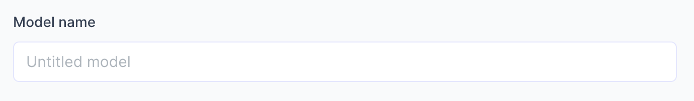

# Create new AI Model

import { Box, TextBox, BoxAction } from '@site/src/components/Box';
import BoxContainer from '@site/src/components/BoxContainer';
import HeaderText from '@site/src/components/HeaderText';

import Tabs from '@theme/Tabs';
import TabItem from '@theme/TabItem';

Creating your `AI Model` is the first step in a `Flow`. 

While creating an `AI Model` and starting to scan documents is quick and easy, getting your model to *scan well* requires careful planning, as will become clear as we progress. 

In this section we will: 
- Show you where to create a `New model`. 

- Discuss whether you should start with a new model `from scratch` or choose a `template` model that is pre-trained on a specific document type (i.e receipts, invoices, contracts, etc.).

- Discuss how flexible an `AI Model` is. For example, if your documents have a lot of variation, will one AI Model be able to scan the various documents correctly? Will extra measures be necessary?

- Show you how to define the `fields` you want to extract from your own documents.

## Create New model

From your `Flows` overview, click on **`New Model`**. You will be taken to this screen:

There are three tasks we need to complete here:

- Give the model a name.
- Choosing whether to start with a model from scratch or use a template model.
- Defining the fields we want to extract.

### Give your model a name
(Info about hwat model name is used for)

### Create a model from scratch or use a template?

First off, any model created in Cradl AI, whether from scratch or from a template, utilises Cradl's state-of-the-art base model under the hood. When you create an `AI Model`, you are working on top of the base model Cradl AI has engineered to understand documents.

So, whats the difference between starting from scratch or using a template?
<Tabs>
  <TabItem value="apple" label="From scratch" default>
    Pros:
    - You tell 
    - Me
    - Man

    Here is body text.

    Cons:
    - Shit
    - Is 
    - Bad
  </TabItem>
  <TabItem value="orange" label="From template">

  Pros:
    - I dont
    - know 
    - man

Here is an image
   

    Cons:
    - Shit
    - Is 
    - Great

Another image
   

  </TabItem>
</Tabs>
 

## Defining fields to extract from your documents

### Data that is *nice to have* VS data that you *need*

{/* <BoxContainer>
  <Box border="none" padding="6px" background="none" width="400px">
    <HeaderText icon="/img/steps/01.svg" title="Build" text="Build and train high-accuracy document parsing models for any document." />
    <HeaderText icon="/img/steps/02.svg" title="Deploy" text="Deploy and integrate your model with developer-friendly REST APIs." />
    <HeaderText icon="/img/steps/03.svg" title="Improve" text="Continuously improve your deployed model over time with seamless feedback loops." />
  </Box>
</BoxContainer>

<BoxContainer>
  <Box title="Quickstart" width="450px">
    

        Get up and running quickly by using pre-trained models. You can later clone and customize them to fit your 
        needs.
    

    <BoxAction text="Parse invoices and receipts" href="../get-started/parse-invoices-and-receipts" />
    <BoxAction text="Go to pre-trained models" href="https://app.cradl.ai/models" />
  </Box>

  <Box title="Build high accuracy parsers" width="450px">
    

        Follow step-by-step instructions to create your first high accuracy document parser with Cradl.
    

    <BoxAction text="Train a high accuracy model on large datasets" href="../get-started/train-high-accuracy-models-on-large-datasets" />
  </Box>

</BoxContainer> */}