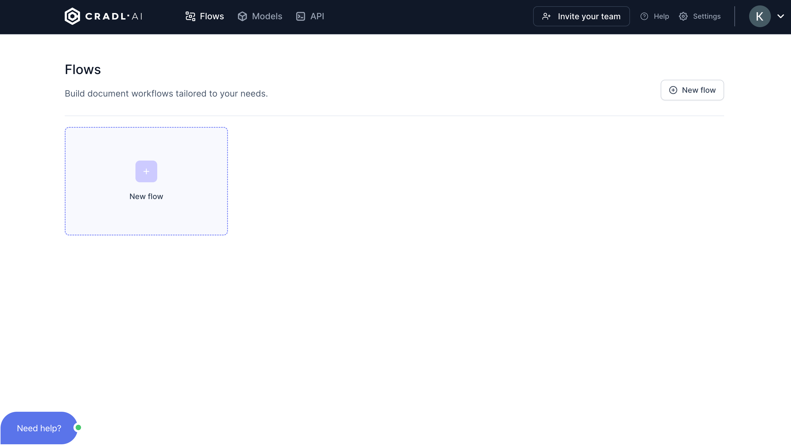

# Setting up your workspace
Welcome to Cradl AI. This **Getting Started Guide** is intended to take you from start to finish in Cradl AI. Once you have completed the guide, you will:
- have an AI model that is trained to scan your test documents and real documents. 
- have a workflow where you automatically import documents (images and PDFs), scan them into structured data, and export the data to your preferred destination.
- be able to easily bring your organization's documents into your workflow and have a proof of concept.
- be able to adapt your model to new types of documents in the future.

This guide does not assume that you are a programmer. Cradl AI is designed to enable you to create and and maintain your own AI models without requiring a specialist or adding technical overhead to your organization. It's DIY.

:::info

This guide does assume that you've created a [free Cradl AI account](https://app.cradl.ai/login?redirect=signup&utm_campaign=docs) in order to follow along.

:::

## Sign into Cradl AI and go to Flows
Start by completing the sign-up to a free Cradl AI account. Once logged in, find and click **`Flows`** in the top navigation bar. You will be taken to this screen:

Since we are a new user and don't have any existing flows, create a  **`New Flow`**. You will be taken to this screen:

Welcome to your `Flow` overview.
Your `Flow`, which is Cradl's name for a workspace, is simply a pipeline that connects your (yet to be created) `AI model` with your documents' `Triggers` and `Export` destinations.
- **`Triggers`** Your imported documents - ready to be scanned by your `AI model` (documents can be imported by `manual upload`, `email`, `API`, or `integrations`).

- **`AI model`** Your custom AI model - trained to scan your documents.
- **`Validation`** **(optional)** Newly scanned documents - ready to be validated by you.
- **`Export`** Output destination for your scanned documents (documents can be exported to `webhook`, `API`, `integrations`, `CSV`, etc).

Simply put, your `Triggers` and `Export` are where you get your documents in and out of Cradl AI. You need only configure them once. Your `AI Model` is where your documents (images or PDFs) are scanned and converted into structured data. `Validation` is where your `AI Model` will send documents whose accuracy it is unsure of and therefore ask for your feedback. Your feedback will improve your model over time.

We will configure each of these 4 stages, and will begin by configuring a new `AI model` in the next section of this tutorial. 

## Give your Flow a name
The name is only for your own convenience. Give your `Flow` a name that reflects the type of documents you will be scanning. For example: "Inbound invoices flow", "Receipts flow".

 