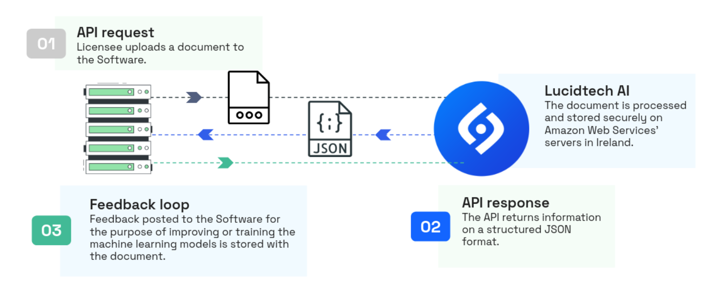

# Description of Service

The Service is a cloud-based service for automating document workflows based on technology that extracts key information from scanned, photographed or digital documents by using machine learning technology. The Service is provided as a web application and as a REST API. As part of the processing, the Service uses machine learning models to extract information from unstructured documents.

All predictions made by the machine learning models shall be considered as suggestions, and Licensee is responsible for deciding whether to trust the suggested result of the scanning and use the information from the scanning as suggested.

## **1. DATA FLOW**

The following diagram illustrates the flow of document data when using the Service:

**Description of the processing:**

1. Licensee posts a document to the Service. A retention policy is used by Lucidtech to determine how long the document can be stored and used for further training. The document is stored securely on Lucidtech’s servers which are hosted on Amazon Web Services in Ireland.
2. If the document is processed and extracted information is returned as a JSON response. Feedback posted to the Service for the purpose of improving the machine learning models is stored securely with the document.
3. Licensee may at any time delete one or all of the documents posted to the Service by using the API.
4. If the document is submitted to one of Lucidtech’s workflow endpoints as part of the processing, the document will become available in the FLYT automation platform.

## **2. CONTINUOUS TRAINING**

Documents posted to the Service may be used by Lucidtech for training Lucidtech’s machine learning models. The documents are currently pre-processed as following before being used for training:

1. Automatic anomaly checks are run on the collected data to rule out data points that can be detrimental to the training process.
2. Random checks of the data may be conducted by Lucidtech’s employees to rule out data points that can be of detriment to the training process.

After the pre-processing, the following training routine is executed:

1. Lucidtech’s machine learning models are prepared and configured for training by Lucidtech.
2. The trained models are evaluated, tested and deployed to production if the new model is significantly better (in terms of statistical significance) than the previous model.

## **3. FEATURES**

A complete description of features and capabilities of the Service is available in Lucidtech’s [documentation](/).
