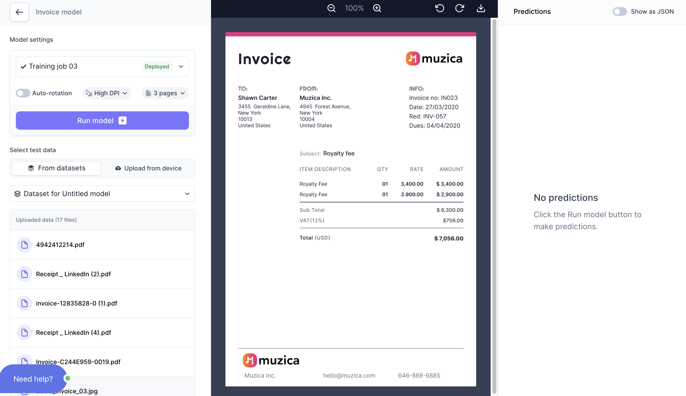
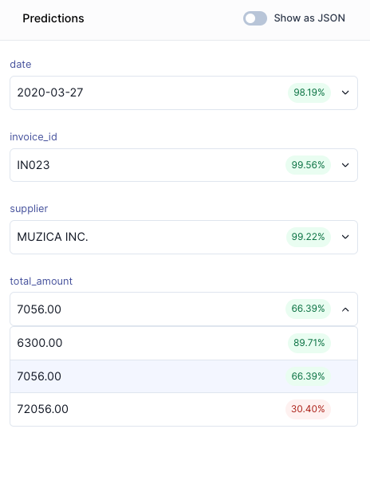

# Scan your first documents
 You finally have a working `AI model`. In this section, we will: 

- Test our `AI Model`

After you clicked **`Test model`**, you should find yourself in the `Test studio`:

## Select a document to test
Either select an existing document from your training documents, or upload a new document. Click **`Run`**, and you will see the extracted data from your document: 

Congratulations, you just scanned your first document with your own `AI Model`. 

Let us inspect the output: 

 

The model: 
- predicted every 5/6 `fields` correctly except for `currency`. 
- predicted `total_amount` correctly, but the correct option was third likeliest prediction.
- ISO formats dates automatically.

In the previous step, we saw how the AI Model had an `accuracy` value of only 18% in the `currency` field. This score is unlikely to improve unless we train on more data or review our annotation values.

## Go to Validation
Now that we have tested our `AI Model` it is time to leave the `Test studio` and and upload some real documents in the `Validation studio`. Go back to your `Flows`overview (by clicking the Cradl AI logo in the top navigation) and click on `Go to validator`
