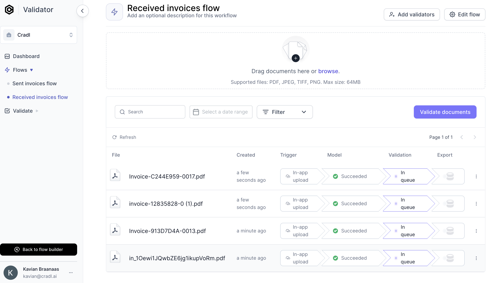
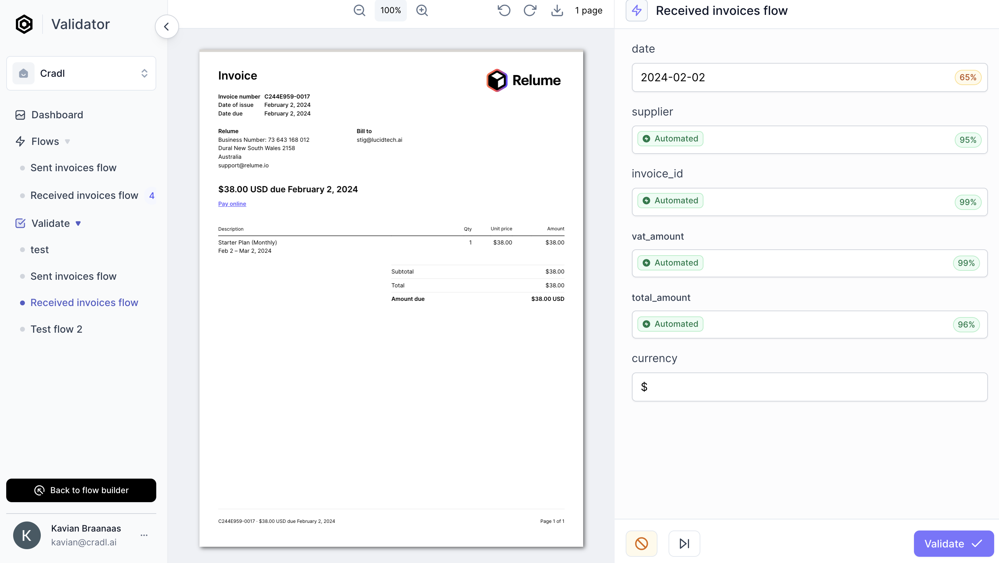

# Validate scanned documents

Welcome to your `Validator studio`:

The `Validation studio` and `Test studio` and  work very similarily. 
- Simply upload your documents.
- You will notice that your `AI Model` will automatically start running and scan documents when they are uploaded from the `Validation studio`:

Once your model has stopped running (click  **`refresh`** for status updates), click on **`Validate documents`**:

- Just like in the `Testing Studio`, you can validate whether the `AI Model` predicted correctly. 
- Unlike the the `Testing Studio`, the `Validation Studio` lets you provide feedback to your model in order to correct and improve the model (I have added a "$" for currency). These corrections will improve your model next time your train it. 

Congratulations. You know have an AI model that automatically scans manually uploaded documents. In the next and the final part of this tutorial, we will set up automated uploads of documents instead of manual uploads. 