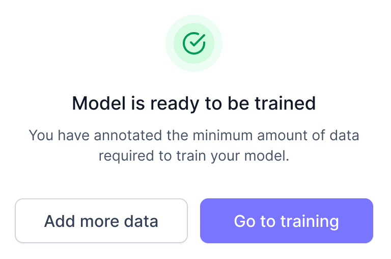
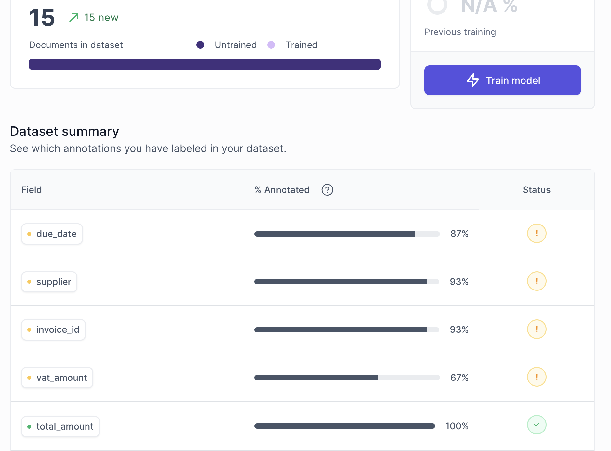

# Annotating training documents
The `annotation` stage is where you tell your `AI Model` "what to look for" when it scans your documents.

After uploading your first training documents, you will be taken to this screen:

When scanning your documents, your `AI Model` uses a mix of vision and textual understanding. This is important to keep in the back of your mind when you annotate your training documents. Typically, you will want your input to **mirror** the document as closely as possible. For example: if a date is written in MM/DD/YYYY format, type it as a MM/DD/YYYY date rather than DD/MM/YYYY, vice versa.

Here are some tips for each field `type` to help you make informed decisions when you `annotate` your training documents:

  
String

  
In addition to regular text and text+numbers, use strings are addresses, which you can create in one `string` field my mirroring how the address is depicted in your documents: 

  

    
  

  
Amount

  
When you type something in the `amount` field, your input will be **auto-formatted:** 

  - **Commas** "," are formatted to separate thousands. 
  - **Dots** "." are formatted to separate decimals. 
  
For example: Fifteen-thousand will look like: 15,000.00

  
Date

  
Dates are very common to extract. When you type a date in a `date` field, you must **mirror** the way the date is written on your document. 

  :::info
  If you created your model before 30th April 2024, you must continue entering dates in a DD/MM/YYYY format instead of mirroring what is written in your document.
  :::

  
Numeric

  
Numeric is used for numbers, such as quantities, numeric IDs, etc. A Numeric field does not accept letters. 

  
Line items

  
 Line items are used for multiline tabular data. You do not have to annotate every single item in the table - 3 will do. If there are more than 3 items, pick 3 random items rather than the first three for better results.

  

  
  

  
Classification

  
Epcot is a theme park at Walt Disney World Resort featuring exciting attractions, international pavilions, award-winning fireworks and seasonal special events.

## Complete annotation
Once you havee annotated at least 15 documents, you're presented with two options: 

   

Click **`Go to training`**

## Review annotation
This will take you to a summary of your annotation.

- `Green` checkmarks means that you have provided at least 15 samples of a `field`. Well done. 
- `Yellow` checkmarks means that you have not provided at least 15 samples of a `field`. While not necessary for testing, it is recommended that you provide at least 15 samples.

Congratulations, you have finished the hard part. In the next section, it is time for your `AI model` to start working.