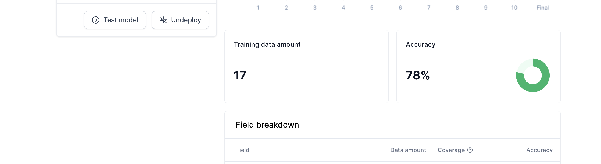

# Run initial training

In this section, we will: 
- run your first training. 
- review your training results.

## Run training
- From your annotation summary, click **`Train model`** to begin the model's initial training.

Training usually takes from 20 to 60 minutes. While your model is training, you can monitor the training progress by clicking **`View training details`** from your `Flow` overview:

No action is required from you here. Simply wait until the training is over.

## Review training
Once your training is complete, you can view the results of your training: 
- Example of training gone **pretty well**: 

- Example of training gone **poorly**:

Poor training results are usually the result of either: 
 - Insufficient training volume.
 - Annotation that misleads the AI Model. 

Most initial training results are not perfect, and in this tutorial we will continue with the model that scored poorly in the `currency` field. This will show how the `AI Model` will continuously struggle with a field it has been poorly trained in.

## Go to Testing
After reviewing your training results, click **`Test model`** from the training results screen: 

