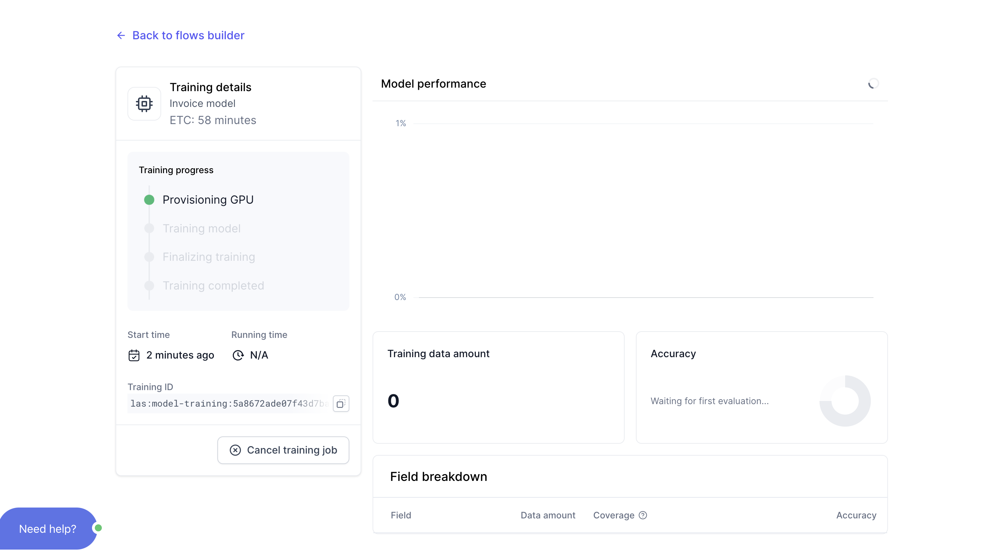
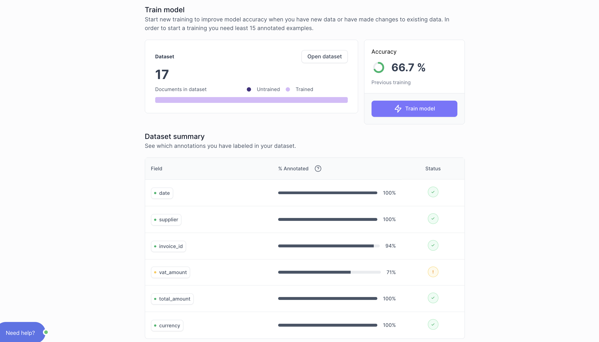

# Run initial training

In this section, we will: 
- run your first training. 
- review your training results
- Troubleshoot poor training results

## Run training
- Click **`Train model`** to run the model's initial training. Training usually takes from 30 to 60 minutes.

While your model is training, you can monitor the training progress by clicking **`View training details`** from your `Flow` overview:

No action is required from you here. Simply wait until the training is over.

## Review training
Once your training is complete, you can view the results of your training: 
- Example of training gone **pretty well**: 

- Example of training gone **poorly**:

## Troubleshooting poor training results

There are two main reasons for why a training might go poorly:
- The model simply needs more data to improve. 
- There is a misunderstanding between the way you have annoted your documents and how the model behaves.

## Go to Testing
After reviewing your training results, click **`Test model`** from the training results screen: 

